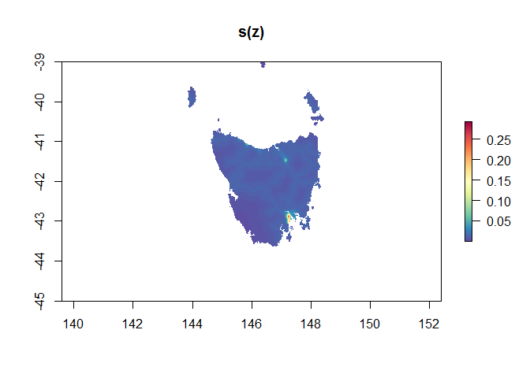
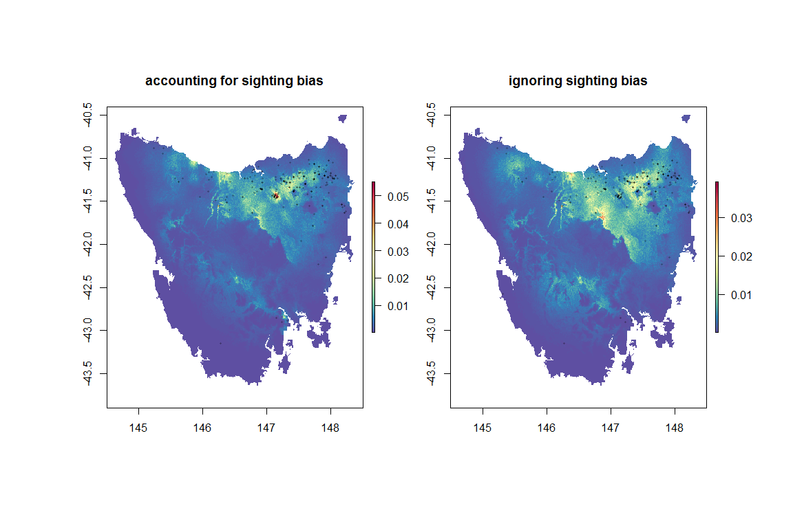

qrbp is an r package for generating quasi random background points for Poisson point process models.
----------------------------------------------------------------------------------------------------

The package aims to generate quasi-random background point for use in Poisson point process models. Quasi-random points are an alternative to grid-based or random background point designs. Quasi-random (sampling) background points are an advanced form of spatially-balanced survey design or point stratification, that aims to reduce the frequency of placing samples close to each other (relative to simple randomisations or grid designs). A quasi-random background point design improves efficiency of background point sampling (and subsequent modelling) by reducing the amount of spatial auto-correlation between data implying that each sample is providing as much unique information as possible (Grafston & Tille, 2013) and thus reducing low errors for geostatistical prediction (Diggle & Ribeiro, 2007).

``` r
devtools::install_github('skiptoniam/qrbp')
```

There are two main functions in the `qrbp` package, the first and main function can be used to generate background points within a spatial domain. Generation of background points can be used in Poisson point process modelling in R. The main function is `generate_background_points`, which takes a Raster\* as a study area, covariates - which are a Raster stack on the of the same resolution and extent as the study area.

Import some species data and covariates for modelling

``` r
library(sdm)
library(raster)

file <- system.file("external/species.shp", package="sdm") # 
species <- shapefile(file)
path <- system.file("external", package="sdm") # path to the folder contains the data
lst <- list.files(path=path,pattern='asc$',full.names = T) 
preds <- stack(lst)
projection(preds) <- "+proj=merc +lon_0=0 +k=1 +x_0=0 +y_0=0 +a=6378137 +b=6378137 +units=m +no_defs"
```

plot the presence only data (occurrences==1), in the dataset we have the luxury of absences which means that if you were going to model this species correctly, you could do it using absences and have no need generate background points.

``` r
plot(preds[[1]])
points(species[species$Occurrence == 1,],col='red',pch=16,cex=.5)
```

For a laugh, let's generate some quasirandom background points and plot them against the presence points. Here we are using the `quasirandom_covariates` method which tries to select quasirandom points across geographic and environmental space. The other working methods are `quasirandom` which just creates quasirandom points spatially, or `grid` which creates a regular grid at a set resolution - this is every similar to the grid design proposed by Warton *et al.,* 2010.

``` r
library(qrbp)
POdata <- species[species$Occurrence == 1,]
bkpts_quasi <- generate_background_points(number_of_background_points = 300,
                                    known_sites = POdata@coords,
                                    study_area = preds[[1]],
                                    model_covariates = preds,
                                    method = 'quasirandom_covariates')
```

For a laugh, let's generate some quasirandom background points and plot them against the presence points

``` r
POdata <- species[species$Occurrence == 1,]
bkpts_grid <- generate_background_points(known_sites = POdata@coords,
                                    study_area = preds[[1]],
                                    model_covariates = preds,
                                    resolution = 16000, # this needs to be relative to raster resolution - this is about half the input resolution of the raster.
                                    method = 'grid')
```

Now let's plot our background points. We can see on the left plot that the points look randomly distributed, these are the quasi-random background points. While the right plot is a regular grid.

``` r
par(mfrow=c(1,2))
plot(preds[[1]])
points(bkpts_quasi[bkpts_quasi$presence == 0,c("x","y")],col='blue',pch=16,cex=.3)
points(bkpts_quasi[bkpts_quasi$presence == 1,c("x","y")],col='red',pch=16,cex=.6)
plot(preds[[1]])
points(bkpts_grid[bkpts_grid$presence == 0,c("x","y")],col='blue',pch=16,cex=.3)
points(bkpts_grid[bkpts_grid$presence == 1,c("x","y")],col='red',pch=16,cex=.6)
```

Now let's try and generate a ppm using a Poisson gam. We are going to need more integration points (background points) in order to develop a robust Poisson Point Process model. If you look at the great Fithian & Hastie (2014) or Warton & Shepard (2010) papers they show that if you start to approach an infinite number of integration points you should converge on the correct estimate of the intensity of occurrence (not quite correct) within the study region. Infinity is a big number - so how about we aim for about 20,000 background points. If are getting close the summed relative likelihood of occurrence should approximately equal the number of presence points, in this case study 94 occurrence points.

``` r
library(mgcv)
bkpts_quasi <- generate_background_points(number_of_background_points = 20000,
                                    known_sites = POdata@coords,
                                    study_area = preds[[1]],
                                    model_covariates = preds,
                                    method = 'quasirandom_covariates')
fm1 <- gam(presence ~ s(elevation) +
              s(precipitation) +
              s(temperature) +
              s(vegetation) + offset(log(weights)),
              # weights = weights,
              data = bkpts_quasi,
              family = poisson())

p1 <- predict(object=preds,
             model=fm1,
             type = 'response',
             const=data.frame(weights = 1))

p1_cell <- p1*(res(preds)[1]*res(preds)[2])
POdata <- species[species$Occurrence == 1,]
bkpts_grid <- generate_background_points(known_sites = POdata@coords,
                                    study_area = preds[[1]],
                                    model_covariates = preds,
                                    resolution = 2110, # this needs to be relative to raster resolution - this is about half the input resolution of the raster.
                                    method = 'grid')

fm2 <- gam(presence ~ s(elevation) +
              s(precipitation) +
              s(temperature) +
              s(vegetation) + 
              offset(log(weights)),
              data = bkpts_grid,
              family = poisson())

p2 <- predict(object=preds,
             model=fm2,
             type = 'response',
             const=data.frame(weights = 1))

p2_cell <- p2*(res(preds)[1]*res(preds)[2])

plot(p2_cell)

fm_warton2010 <- gam(presence/weights ~ s(elevation) +
              s(precipitation) +
              s(temperature) +
              s(vegetation),
              weights = weights,
              data = bkpts_grid,
              family = poisson())

p_warton <- predict(object=preds,
             model=fm_warton2010,
             type = 'response',
             const=data.frame(weights = 1))

p_warton_cell <- p_warton*(res(preds)[1]*res(preds)[2])
```

Now let's plot these models.

``` r
jet.colors <- colorRampPalette(rev(RColorBrewer::brewer.pal(11 , "Spectral")))
par(mfrow=c(1,3),oma=c(4,4,4,4))
plot(p1_cell,col=jet.colors(100),main='quasi_random offset')
plot(p2_cell,col=jet.colors(100),main='grid offset')
plot(p_warton_cell,col=jet.colors(100),main='grid ala Warton2010')
```

Let's buld a PA species distribution based on the actual occurrence data and see how we go.

``` r
d <- sdmData(formula= ~., train=species, predictors=preds)
dat <- cbind(species$Occurrence,d@features)
colnames(dat)[1]<-'occurrence'
fm3 <- gam(occurrence ~ s(elevation) +
              s(precipitation) +
              s(temperature) +
              s(vegetation),
              data = dat,
              family = binomial())

p3 <- predict(object=preds,
             model=fm3,
             type = 'response')
```

Now let's compare the spatial predictions of the PPM against the PA species distribution model, hopefully we are in the right ball park.

``` r
jet.colors <- colorRampPalette(rev(RColorBrewer::brewer.pal(11 , "Spectral")))
par(mfrow=c(2,2),oma=c(4,4,4,4))
plot(p1_cell,col=jet.colors(100),main='quasi_random offset')
plot(p2_cell,col=jet.colors(100),main='grid offset')
plot(p_warton_cell,col=jet.colors(100),main='grid ala Warton2010')
plot(p3,col=jet.colors(100),main='Bernoulli PA gam')
```

Part Two - dealing with sampling bias.
======================================

In section 2.5 *Identifiability and sampling bias* from Fithian & Hastie (2014), they discuss the challenging concept of accounting for sampling bias in presence-only models. The discuss how obtaining the *observation process* is difficult to achieve using precence-only data, and only really be related to the *sighting process*. This is because absences aren't explicitly recorded, so we aren't recording occurrence records, rather we only have information on sightings (presences). They state that if detection is independent across occurrences, then the *observation process* within a PPM should be defined as:

$$\\lambda(z) = \\tilde \\lambda(z) \\cdot s(z)$$

If we assume that there is no sampling bias, then by estimating *λ*(*z*) we are also estimating $\\tilde \\lambda(z)$, despite this assumption, we can only every obtain relative probabilities of occurrence (see Phillips and Elith 2013). Effectively this is what we have achieved in the sections above.

An alternative approach is to assume the *s* is an unknown function of *z*, but are known to depend on $\\tilde \\lambda(z)$ in this case, we could model *z* and *s* as log-linear features of the covariates *x*<sub>1</sub>(*z*) and *x*<sub>2</sub>(*z*). Where *x*<sub>1</sub>(*z*) are covariates that contribute to our understanding of *β*, how our species response to covariates (the slopes).

To estimate *s* we can pool information on the occurrence of all other presence-only sightings from similar species and uses these to offset sampling effort. This is similar to idea proposed by Fithian *et al.,* 2015, where they use information from multiple species, including presence-only data to address sampling bias.

Here we are going to achieve this as a two part modelling process and firstly try and quantify the *sighting effort* as a function of covariates likely to inform *sighting process*.

Here we are going to try and model the distribution of *Victaphanta lampra* a nifty carnivorous snail form southern Australia. It's part of the Rhytididae family of gastropod snails, so we are going to use the occurrence records of other species within this family as an offset to try and disentangle some of the sampling biases for these little guys. Today we are going to concentrate on Tasmania. I like Tasmania.

``` r
install.packages('ALA4R')
library(ALA4R)
ala_config(caching="off")
ala_config(download_reason_id=0)
wkt <- "POLYGON((148.5 -44,148.5 -40.5,144.5 -40.5,144.5 -44,148.5 -44))"
x <- occurrences(taxon="family:Rhytididae",wkt=wkt,qa="all",download_reason_id = 7)
x <- x$data ##
write.csv(x,file = "./data_files/rhytididae_records_ala.csv")
```

Load in the previously downloaded occurrence (sightings) records.

``` r
library(mgcv)
```

    ## Loading required package: nlme

    ## 
    ## Attaching package: 'nlme'

    ## The following object is masked from 'package:raster':
    ## 
    ##     getData

    ## This is mgcv 1.8-16. For overview type 'help("mgcv-package")'.

``` r
library(raster)
x <- read.csv("./data_files/rhytididae_records_ala.csv")
rhytidaidae_sp <- subset(x,assumedPresentOccurrenceStatus==TRUE)
v_lampra <- subset(x,species=='Victaphanta lampra')
```

Let's get some climate data

``` r
climate <- getData('worldclim', var='bio', res=0.5, lon=145, lat=-40)
tas_climate <- crop(climate,e)
```

Now let's get human population layers, I've downloaded a raster from [NASA](https://neo.sci.gsfc.nasa.gov/view.php?datasetId=SEDAC_POP), which is a course scale representation of human population density. I've re-sampled this raster to be at the same extent and resolution as the climatic layers.

``` r
pop <- raster('./data_files/pop_density.tiff')
tas_pop <- crop(pop,e)
tas_pop[tas_pop>20000]<- NA
tas_pop_rs <- resample(tas_pop,tas_climate[[1]],method="bilinear")
tas_pop<-mask(tas_pop_rs,tas_climate[[1]])
```

Now some roads, this is a shape file I've previously downloaded from [Listmap](http://maps.thelist.tas.gov.au/listmap/app/list/map). I developed a distance from main roads, including national and state highways and any major arterial roads. Using these roads, I've then created a raster that represents distance from roads.

``` r
library(sp)
tassie_roads <- shapefile(x = "./data_files/StateHighwaysandSubsidiaryRoads.shp")
tassie_highways <- tassie_roads[tassie_roads$TRAN_CLASS=='National/State Highway'|tassie_roads$TRAN_CLASS=='Arterial Road',]
tassie_highways_geo <- spTransform(tassie_highways, CRS("+proj=longlat +datum=WGS84 +no_defs +ellps=WGS84 +towgs84=0,0,0"))
y <- rasterize(tassie_highways_geo, tas_climate[[1]])
d <- distance(y)
tas_dist_from_roads <- mask(d,tas_climate[[1]])
```

Now let's try and select a few key layers.

``` r
tassie_preds <- stack(tas_climate[[1]],tas_climate[[5]],tas_climate[[6]],
  tas_climate[[12]],tas_climate[[14]],tas_pop,tas_dist_from_roads)
names(tassie_preds)<-c("annual_mean_temperature","annual_precipitation","max_temperature_of_warmest_month","min_temperature_of_coldest_month","precipitation_of_driest_month","human_population_density","distance_from_main_roads")
writeRaster(tassie_preds, filename="./data_files/tassie_predictors.tif", options="INTERLEAVE=BAND", overwrite=TRUE)
```

Now that we have environmental, social and infrastructural layers that could be meaningful to describe the distribution of *Victaphanta lampra*, we can used the distribution of other Rhytididae species and the covariates that might inform sighting processes to develop a model, that can be used as a covariate to inform *s*(*z*). Yay.

``` r
library(qrbp)
tassie_preds<- stack("./data_files/tassie_predictors.tif")
names(tassie_preds)<-c("annual_mean_temperature","annual_precipitation","max_temperature_of_warmest_month","min_temperature_of_coldest_month","precipitation_of_driest_month","human_population_density","distance_from_main_roads")
po_rhytididae <- rhytidaidae_sp[,c("longitude","latitude")]
bkpts_rhytididae <- generate_background_points(known_sites = po_rhytididae,
                                          study_area = tassie_preds[[1]],
                                          model_covariates = tassie_preds,
                                          resolution = 0.016,
                                          method = 'grid')

bias_snails <- gam(presence/weights ~ s(human_population_density) +
                                      s(distance_from_main_roads),
                                      weights = weights,
                                      data = bkpts_rhytididae,
                                      family = poisson())

p_bias <- predict(object=tassie_preds,
             model=bias_snails,
             type = 'response',
             const=data.frame(weights = 1))

p_bias_cell <- p_bias*area(tassie_preds)*1000
jet.colors <- colorRampPalette(rev(RColorBrewer::brewer.pal(11 , "Spectral")))
plot(p_bias_cell,col=jet.colors(100),main="s(z)")
```



The probability of *absence in an area of size A* according to the Poisson distribution is:

*p**r*(*y* = 0)=*e**x**p*(−*s*(*z*)\**A*)

The prob of *presence* is then:

*p**r*(*y* = 1)=1 − *p**r*(*y* = 0)
=1 − *e**x**p*(−*s*(*z*)\**A*)

where *s*(*z*) = the intensity value at point *z* and *A* is the area of the sampling unit (cell size). *s* is estimated based on the distribution of Rhytididae species and covariates that aim to explain sampling bias, in this example we have used human population density and distance from main roads. (I'm not sure if this is right? Maybe it's just *s*(*z*), I need to double check)

``` r
po_v_lampra <- v_lampra[,c("longitude","latitude")]
tassie_preds_two <- stack(tassie_preds,(1 - exp(p_bias_cell*-1)))
names(tassie_preds_two)[8] <- 'bias'

bkpts_v_lampra <- generate_background_points(known_sites = po_v_lampra,
                                          study_area = tassie_preds_two[[1]],
                                          model_covariates = tassie_preds_two,
                                          resolution = 0.016,        
                                          method = 'grid')
```

Now that we have estimated *s*(*z*) we can use it as an offset in the estimation of $ (z)$. If we refer to Fithian and Hastie 2014, we can see back in section 2.5 *Identifiability and sampling bias* that $\\lambda(z) = \\tilde \\lambda(z) \\cdot s(z)$, so we can directly translate this into an offset within a model that aims to estimated the *observation process* for *Victaphanta lampra*. This is because:

$$\\lambda(x)= e^{\\tilde \\alpha + \\tilde\\beta^\\prime x\_1(z)} e^{\\gamma^\\prime + \\delta x\_2(x)}$$

So we are assuming x1 and x2 are linearly independent. That is, there is little linear correlation between environmental covariates and our observation covariates, and we assume that the population and distance from roads explains sighting process, while the environmental covariates that describe various aspects of temperature and precipitation accounts for the occurrence process. This assumption of being linearly independent can fall over, in such a case, using information form presence-absence data like in Fithian *et al* 2015 can help address this problem.

``` r
fm_v_lampra_w_s <- gam(presence/weights ~ s(annual_mean_temperature) +
                                      s(annual_precipitation) +
                                      s(max_temperature_of_warmest_month) +
                                      s(min_temperature_of_coldest_month) +
                                      s(precipitation_of_driest_month) +
                                      offset(log(bias)),
                                      weights = weights,
                                      data = bkpts_v_lampra,
                                      family = poisson())

fm_v_lampra_wo_s <- gam(presence/weights ~ s(annual_mean_temperature) +
                                      s(annual_precipitation) +
                                      s(max_temperature_of_warmest_month) +
                                      s(min_temperature_of_coldest_month) +
                                      s(precipitation_of_driest_month),
                                      weights = weights,
                                      data = bkpts_v_lampra,
                                      family = poisson())


p_v_lampra_w_s <- predict(object=tassie_preds_two,
             model=fm_v_lampra_w_s,
             type = 'response',
             const=data.frame(weights = 1,bias=1))

p_v_lampra_wo_s <- predict(object=tassie_preds_two,
             model=fm_v_lampra_wo_s,
             type = 'response',
             const=data.frame(weights = 1))


p_v_lampra_w_s_cell <- p_v_lampra_w_s*area(tassie_preds_two)*1000
p_v_lampra_wo_s_cell <- p_v_lampra_wo_s*area(tassie_preds_two)*1000
jet.colors <- colorRampPalette(rev(RColorBrewer::brewer.pal(11 , "Spectral")))

par(mfrow=c(1,2),oma=c(4,4,4,4))
plot(p_v_lampra_w_s_cell,col=jet.colors(100),main='accounting for sighting bias',
  xlim=c(144.5, 148.5), ylim=c(-43.8,-40.5))
points(po_v_lampra,pch=16,cex=0.4,col=rgb(0, 0, 0, 0.3))
plot(p_v_lampra_wo_s_cell,col=jet.colors(100),main='ignoring sighting bias',
  xlim=c(144.5, 148.5), ylim=c(-43.8,-40.5))
points(po_v_lampra,pch=16,cex=0.4,col=rgb(0, 0, 0, 0.3))
```



### References

Diggle, P. J., P. J. Ribeiro, Model-based Geostatistics. Springer Series in Statistics. Springer, 2007.

Fithian, William, and Trevor Hastie. "Finite-sample equivalence in statistical models for presence-only data." The annals of applied statistics 7.4 (2013): 1917.

Fithian, William, et al. "Bias correction in species distribution models: pooling survey and collection data for multiple species." Methods in Ecology and Evolution 6.4 (2015): 424-438.

Grafström, Anton, and Yves Tillé. "Doubly balanced spatial sampling with spreading and restitution of auxiliary totals." Environmetrics 24.2 (2013): 120-131.

Phillips, S. J. and Elith, J. (2013). On estimating probability of presence from use-availability or presence-background data. Ecology 94 1409-1419.

Warton, D. I., and L. C. Shepherd. "Poisson point process models solve the pseudo-absence problem for presence-only data in ecology." The Annals of Applied Statistics 4.3 (2010): 1383-1402.
