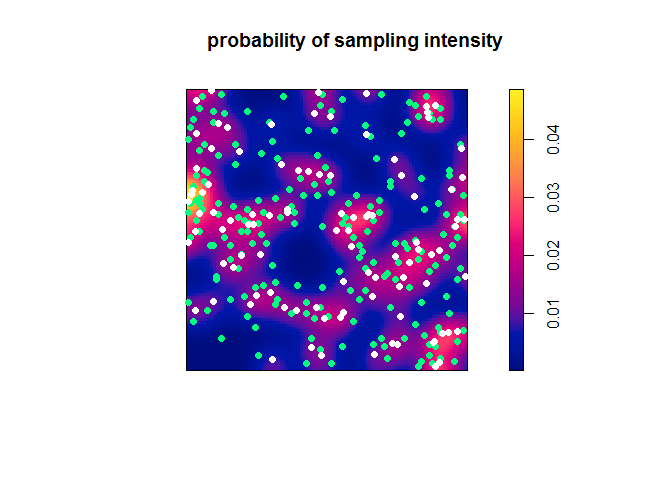
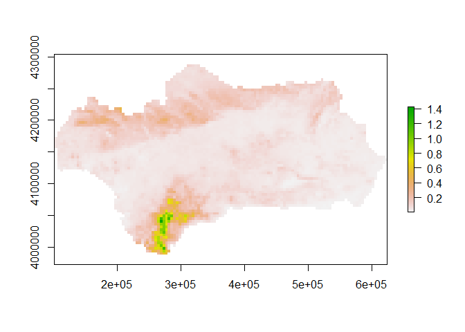
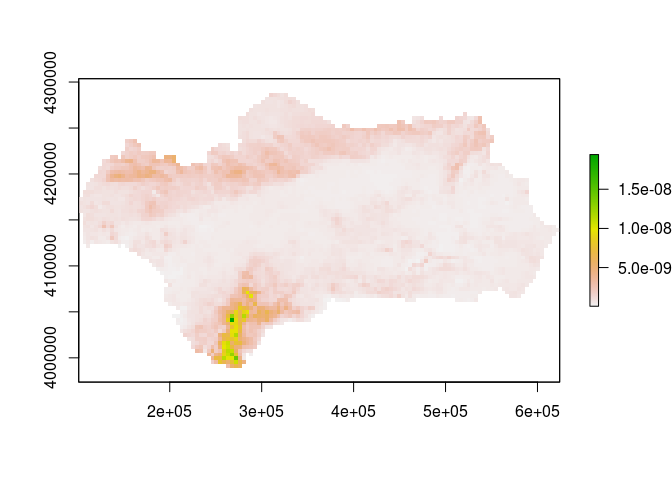

qrbp is an r package for generating quasi random background points for Poisson point process models.
----------------------------------------------------------------------------------------------------

The package aims to generate quasi-random background point for use in Poisson point process models. Quasi-random points are an alternative to grid-based or random background point designs. Quasi-random (sampling) background points are an advanced form of spatially-balanced survey design or point stratification, that aims to reduce the frequency of placing samples close to each other (relative to simple randomisations or grid designs). A quasi-random background point design improves efficiency of background point sampling (and subsequent modelling) by reducing the amount of spatial auto-correlation between data implying that each sample is providing as much unique information as possible (Grafston & Tille, 2013) and thus reducing low errors for geostatistical prediction (Diggle & Ribeiro, 2007).

``` r
devtools::install_github('skiptoniam/qrbp')
```

There is one main function in the `qrbp` package, which is used to generate background points to be used in Poisson point process modelling. The function `generate_background_points`, takes know species presences, a Raster\* as a study area, covariates - which are a Raster stack on the of the same resolution and extent as the study area, and a bunch of other minor calls to produce a dataset that will enable Poisson point process modelling.

Import some species data and covariates for modelling

``` r
library(sdm)
library(raster)

file <- system.file("external/species.shp", package="sdm") # 
species <- shapefile(file)
path <- system.file("external", package="sdm") # path to the folder contains the data
lst <- list.files(path=path,pattern='asc$',full.names = T) 
preds <- stack(lst)
projection(preds) <- "+proj=merc +lon_0=0 +k=1 +x_0=0 +y_0=0 +a=6378137 +b=6378137 +units=m +no_defs"
```

plot the presence only data (occurrences==1), in the dataset we have the luxury of absences which means that if you were going to model this species correctly, you could do it using absences and have no need generate background points.

``` r
plot(preds[[1]])
points(species[species$Occurrence == 1,],col='red',pch=16,cex=.5)
```



For a laugh, let's generate some quasirandom background points and plot them against the presence points. Here we are using the `quasirandom_covariates` method which tries to select quasirandom points across geographic and environmental space. The other working methods are `quasirandom` which just creates quasirandom points spatially, or `grid` which creates a regular grid at a set resolution - this is every similar to the grid design proposed by Warton & Shepard 2010.

``` r
library(qrbp)
POdata <- species[species$Occurrence == 1,]
sp_sites <- POdata@coords
colnames(sp_sites) <- c("x","y")
bkpts_quasi <- generate_background_points(number_of_background_points = 1000,
                                    known_sites = sp_sites,
                                    study_area = preds[[1]],
                                    model_covariates = preds,
                                    method = 'quasirandom')
```

For a laugh, let's generate some quasirandom background points and plot them against the presence points

``` r
bkpts_grid <- generate_background_points(known_sites = sp_sites,
                                    study_area = preds[[1]],
                                    model_covariates = preds,
                                    resolution = 16000, # this needs to be relative to raster resolution - this is about half the input resolution of the raster.
                                    method = 'grid')
```

Now let's plot our background points. We can see on the left plot that the points look randomly distributed, these are the quasi-random background points. While the right plot is a regular grid.

``` r
par(mfrow=c(1,2),mar=c(4,4,2,5))
plot(preds[[1]])
points(bkpts_quasi[bkpts_quasi$presence == 0,c("x","y")],col='blue',pch=16,cex=.3)
points(bkpts_quasi[bkpts_quasi$presence == 1,c("x","y")],col='red',pch=16,cex=.6)
plot(preds[[1]])
points(bkpts_grid[bkpts_grid$presence == 0,c("x","y")],col='blue',pch=16,cex=.3)
points(bkpts_grid[bkpts_grid$presence == 1,c("x","y")],col='red',pch=16,cex=.6)
```



Now let's try and generate a ppm using a Poisson gam. We are going to need more integration points (background points) in order to develop a robust Poisson Point Process model. If you look at the great Fithian & Hastie (2015) or Warton & Shepard (2010) papers they show that if you start to approach an infinite number of integration points you should converge on the correct estimate of the intensity of occurrence (not quite correct) within the study region. Infinity is a big number - so how about we aim for about 20,000 background points. If are getting close the summed relative likelihood of occurrence should approximately equal the number of presence points, in this case study 94 occurrence points.

``` r
library(mgcv)
bkpts_quasi <- generate_background_points(number_of_background_points = 20000,
                                    known_sites = POdata@coords,
                                    study_area = preds[[1]],
                                    model_covariates = preds,
                                    method = 'quasirandom')
fm <- gam(presence/weights ~ s(elevation) +
              s(precipitation) +
              s(temperature) +
              s(vegetation),
              weights = weights,
              data = bkpts_quasi,
              family = poisson())

p <- predict(object=preds,
             model=fm,
             type = 'response',
             const=data.frame(weights = 1))

p_cell <- p*(res(preds)[1]*res(preds)[2])/4 # resolution of raster changes with bkpts_quasi - need to remember that. 
```

Now let's plot these models.

``` r
jet.colors <- colorRampPalette(rev(RColorBrewer::brewer.pal(11 , "Spectral")))
plot(p_cell,col=jet.colors(100))
points(sp_sites,cex=.5,pch=16)
```



We expect that the overall predicted insensity should equal the number of observed presences in the dataset. Will a little data summary we can see that our predictions are close to the original numner of presence points

``` r
raster::cellStats(p_cell,sum)
```

    ## [1] 94.30407

``` r
nrow(sp_sites)
```

    ## [1] 94

There will be more to come with regard to multi-species point process modelling. Until then.

### References

Diggle, P. J., P. J. Ribeiro, Model-based Geostatistics. Springer Series in Statistics. Springer, 2007.

Fithian, William, et al. "Bias correction in species distribution models: pooling survey and collection data for multiple species." Methods in Ecology and Evolution 6.4 (2015): 424-438.

Grafström, Anton, and Yves Tillé. "Doubly balanced spatial sampling with spreading and restitution of auxiliary totals." Environmetrics 24.2 (2013): 120-131.

Warton, D. I., and L. C. Shepherd. "Poisson point process models solve the pseudo-absence problem for presence-only data in ecology." The Annals of Applied Statistics 4.3 (2010): 1383-1402.
